# 第二回発表資料

## 目次
- [第二回発表資料](#第二回発表資料)
  - [目次](#目次)
  - [どこで依存を注入するのか？](#どこで依存を注入するのか)
    - [合成起点の実装例](#合成起点の実装例)
    - [依存注入は依存を増加している？　その１](#依存注入は依存を増加しているその１)
    - [依存注入は依存を増加している？　その２](#依存注入は依存を増加しているその２)
  - [依存注入のパターン](#依存注入のパターン)
    - [コンストラクタ経由の依存注入](#コンストラクタ経由の依存注入)
    - [コンストラクタ経由の依存注入の実装例](#コンストラクタ経由の依存注入の実装例)
    - [コンストラクタ経由の依存注入のメリット、デメリット](#コンストラクタ経由の依存注入のメリットデメリット)
    - [メソッド経由の依存注入](#メソッド経由の依存注入)
    - [メソッド経由の依存注入の実装例](#メソッド経由の依存注入の実装例)
    - [プロパティ経由の依存注入](#プロパティ経由の依存注入)
    - [結局どの依存注入パターンを利用すればよいか？](#結局どの依存注入パターンを利用すればよいか)
  - [依存注入のアンチパターン](#依存注入のアンチパターン)
    - [コントロールフリーク](#コントロールフリーク)
    - [アンビエントコンテキスト](#アンビエントコンテキスト)
    - [制約に縛られた生成](#制約に縛られた生成)
  - [コードの嫌な臭い](#コードの嫌な臭い)
    - [コンストラクタ経由の過度な注入](#コンストラクタ経由の過度な注入)
    - [抽象ファクトリの過度な利用](#抽象ファクトリの過度な利用)
    - [環境依存の取り除き方](#環境依存の取り除き方)

## どこで依存を注入するのか？

様々なモジュールを合成して、依存を注入する場所を**合成起点**と呼ぶ。

合成起点はオブジェクトグラフがどのように構築されるのかを知っている唯一の場所にすべきで、
合成起点はアプリケーションのエントリポイントに近い場所に配置される。


### 合成起点の実装例

以下のコードのようにあるモジュールを確認するだけで、
アプリケーション全体のオブジェクトグラフがどのように構築されているかわかるように
合成起点を実装する

> 多くの場合は main メソッド内で行われるが、
> 単一のモジュール内で合成起点を実装するのであれば、
> 複数のクラスにわたって合成起点を実装してもよい

```rust
#[derive(Clone)]
pub struct AppModule {
    user_service: Arc<dyn UserService + Send + Sync>
}

impl AppModule {
    pub fn from_config(_config: &AppConfig) -> Self {
        Self {
            user_service: Arc::new(UserServiceImpl::new(
                MemoryUserRepositoryImpl::new()
            ))
        }
    }
    pub fn user_service<'this>(&'this self) -> &'this dyn UserService {
        self.user_service.as_ref()
    } 
}
```

### 依存注入は依存を増加している？　その１

合成起点（エントリポイント）がほかのすべてのモジュールに依存することは、
従来の密結合したアプリケーションよりも依存が増加しているんじゃないかと懸念する人がいる。


| 密結合  | 疎結合  |
|---|---|
|   |   |

### 依存注入は依存を増加している？　その２

密結合のアプリケーションの依存は推移的であるため、
例えばデータアクセス層が変更されたら、UI層やエントリポイントまで影響は伝搬する。

そのため、実際の密結合の依存グラフは以下のようになり、
疎結合の依存グラフよりも一つ依存が多いことになる

| 密結合  | 疎結合  |
|---|---|
|   |   |

## 依存注入のパターン

依存を注入するパターンとしては以下の３パターンは存在する

- コンストラクタ経由の依存注入
- メソッド経由の依存注入
- プロパティ経由の依存注入

### コンストラクタ経由の依存注入

コンストラクタでインスタンスを生成する際に、
依存するオブジェクトを注入するパターン

依存注入のパターンで最も利用されるパターン


### コンストラクタ経由の依存注入の実装例

```rust
pub struct UserServiceImpl<R> {
    user_repository: R
}

/// レポジトリの実装クラスを受け取って、インスタンスを生成している
impl<R> UserServiceImpl<R> {
    pub fn new(user_repository: R) -> Self {
        Self {
            user_repository: user_repository
        }
    } 
}

#[async_trait::async_trait]
impl UserService for UserServiceImpl
where
  R: UserService + Sync + Send 
{
  async fn get_user(&self,user_id: String) -> anyhow::Result<User> {
    /// user_repository が null であることを確認する必要がない
    
    let Some(user) = self.user_repository.get_user(user_id.clone()).await? else {
      anyhow::bail!("not found user [user_id => {:?}]",&user_id)
    }
    return Ok(user)
  }
}
```

### コンストラクタ経由の依存注入のメリット、デメリット

| メリット  | デメリット  |
|:---:|:---:|
|  依存が注入されることを保証する |制約に縛られた生成というアンチパターンを<br>適用するフレームワークによって<br>コンストラクタ経由での注入が困難になる場合がある |
| 実装を簡単に行える|^|
| 依存を必要とするクラスが必要とする依存を静的に宣言できる|^  |

### メソッド経由の依存注入

メソッド経由で依存を注入するパターン

クラス全体で依存することはないが、
メソッドを呼び出すたびに異なる依存が必要となるような場合に利用する

> 下のクラス図は Product 取得時に user_context をメソッドで注入して
> 優待客であれば割引を適用した Product を返すことを想定したクラス図


### メソッド経由の依存注入の実装例

```rust
#[derive(Clone,Debug)]
pub struct Product {
    product_id: String,
    price: f64,
}

impl Product {
    pub fn apply_discount(&mut self,user_context: &dyn UserContext) {
        if user_context.is_role(super::role::Role::Preffered) {
            self.price *=  0.95
        }
    }
}

pub struct ProductServiceImpl<R> {
    product_repository: R
}

impl<R> ProductServiceImpl<R> {
    pub fn new(product_repository:R) -> Self {
        Self {
            product_repository: product_repository
        }
    }
}

#[async_trait::async_trait]
impl<R> ProductService for ProductServiceImpl<R> 
where 
    R: ProductRepository + Sync + Send
{
    async fn get_product(&self,product_id: String,user_context: &(dyn UserContext + Sync + Send)) -> anyhow::Result<Product> {
        let Some(mut product) = self.product_repository.get_product(product_id).await? else {
            anyhow::bail!("not found product");
        };

        product.apply_discount(user_context);
        Ok(product)
    }
}
```

### プロパティ経由の依存注入

### 結局どの依存注入パターンを利用すればよいか？

## 依存注入のアンチパターン

### コントロールフリーク

### アンビエントコンテキスト

### 制約に縛られた生成

## コードの嫌な臭い

### コンストラクタ経由の過度な注入

### 抽象ファクトリの過度な利用

### 環境依存の取り除き方