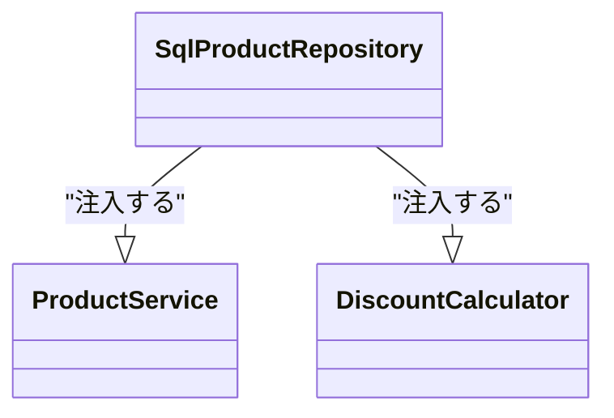
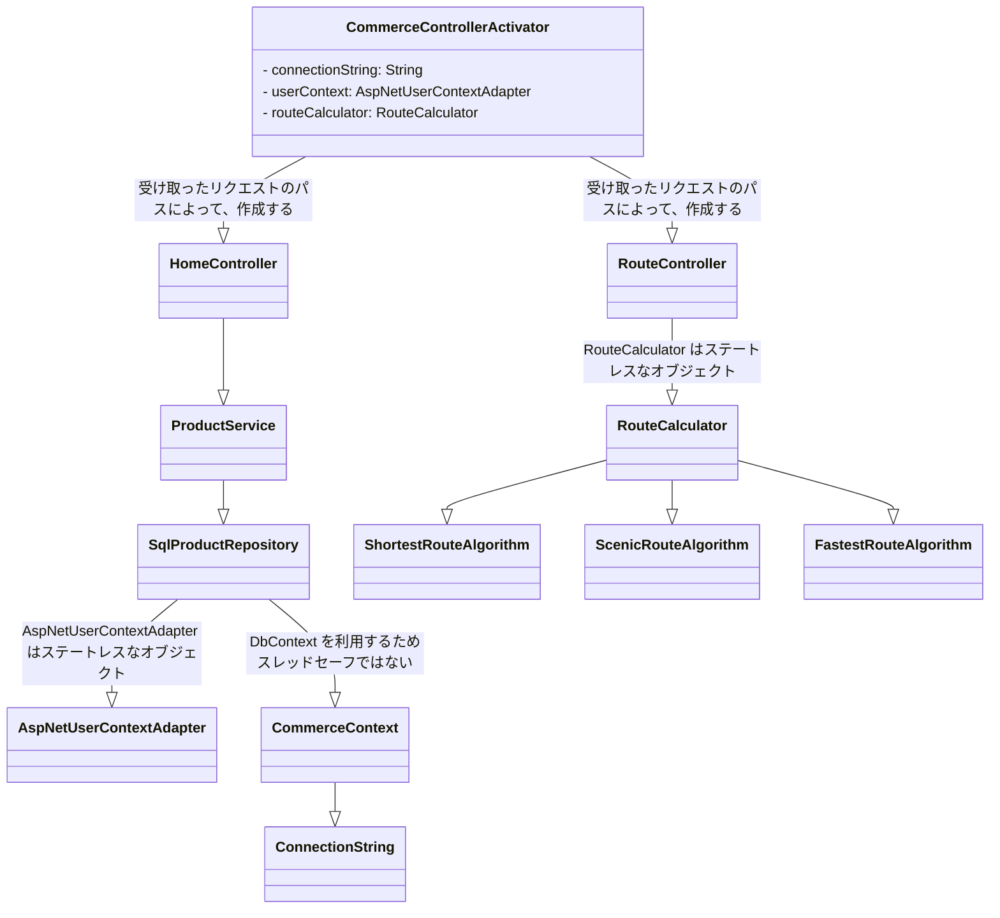

# 純粋なDI

## 目次

[TOC]

## オブジェクト合成

オブジェクト合成については以前の章ですでに説明済み。
ここでは実装するアプリケーション（およびフレームワーク）によって生じる課題を見る

### コンソールアプリケーションの例

ここは samples/third/console-Application でサンプルコードを作成済み。

コンソールアプリケーションでは main 関数内に合成起点を置くことが多く、
main 関数内では以下のようなことを行う

- 構成情報を取得する
  - 外部のファイルや環境変数から取得
- オブジェクトグラフを生成する
  - アプリ-ション内でどのような依存が必要とするか決定する
- 実行引数を解析して実際の処理を行うオブジェクトを返す
- 帰ってきたオブジェクトを実行して処理を行う


### UWP アプリケーションの例

### ASP Core.Net での例

## 依存の生存管理

依存の注入を行うことで依存を必要とするクラスは依存するクラスの制御を手放すことができ、
依存の制御を外部に移譲することができた。

依存の制御をクラスの外部に移譲することはクラスの外部が

- 依存するクラスを選択することができる
- 依存するクラスの生存期間を制御することができる

を意味する。

これらの役割はコンポーザによって行われるべきである。
コンポーザとは合成起点の一部で依存を合成するあらゆるオブジェクトやグラフを指す。

> 多くの場合はDIコンテナをさすが、純粋なDIのコンテキストでは開発者によって実装された
> オブジェクトグラフを構築するメソッドを指す

### 依存の生存管理

依存するクラスと依存を必要とするクラスの生存期間は

依存するクラス >= 依存を必要とするクラス

となる

これは依存を必要とするクラスがスコープを外れる = 依存するクラスへの参照を破棄することとなり、
ガベージコレクタの回収対象となるため(rust だと Drop される)。

そのため、同じインスタンスを複数の依存を必要とするクラスに注入した場合は、
依存を必要とするクラスがすべてスコープから外れてようやく注入したインスタンスを回収できる。

> このことを書籍では Singlton 生存戦略と名付けている
> 設計パターンの Singlton パターンとは異なるものであることに注意する

たとえば、以下のように ProductRepository を実装する SqlProductRepository インスタンスを ProductService と DiscountCalculator の両方に注入した場合、
ProductService と DiscountCalculator の両方が回収されてはじめて、 SqlProductRepository も回収される



以上のような、
いつ依存するオブジェクトを生成して、そのオブジェクトを共有するのか否かという選択は
すべてコンポーザが決定するように設計するべきである

以前の ASP.NET Core MVC アプリケーションではリクエストを受け取るたびに、依存するクラスを作成して以下のようなコントローラを作成していた。

そのためリファクタリングの例として、いかが考えられる。

- AspNetUserContextAdatpter と RouteCalculator はステートレスであり使いまわしても問題ないオブジェクトであるため、シングルトン戦略を取る
  - CommerceControllerActivator のプライベートなフィールドとして保持しておく
- CommerceContext はスレッドセーフなオブジェクトではないため、接続文字列のみを保持しておきリクエストを受けるたびに新しいインスタンスを作成する
  - ConnectionString のみ CommerceControllerActivator で保持しておき、必要に応じて ConnectionString から ProductService や SqlCommerceRepository を作成する

これにより、パフォーマンス効率の向上につながる



### 破棄可能な依存

破棄可能なインタフェースを定義したとする。

> rust だと所有権を渡すか、参照を渡すかしかできないので、
> ここでは C# でのコードを利用する

```csharp
public interface IOrderRepository: IDisposable
```

```csharp
public sealed class OrderService: IDisposable {
  private readonly IOrderRepository repository;
  public OrderService(IOrderRepository repository) {
    this.repository = repository
  }
  /// Dispose を呼び出すことで明示的にオブジェクトを破棄できるようにする
  public void Dispose() {
    this.repository.Dispose();
  }
}
```

以上のような実装を行ってしまうと、OrderService が保持している IOrderRepository の実装クラスを他のクラスと共有していた場合に、例外が発生してしまう。

```csharp
var repository = new SqlOrderRepository(connectionString);

// 同じレポジトリクラスを共有している
var validator = OrderValidator(repository);
var orderService = new OrderService(repository);

// 同じ OrderRepository が OrderValidator でも使われているが、
// orderService.Dispose() を呼び出した時点で破棄されてしまっている。
// そのため、OrderRepository を必要とする OrderValidator.Validate(order) で例外が発生する
orderSeervice.Dispose();
validator.Validate(order)
```

以上のことから、抽象を受け取ったクラスは受け取った依存が履き可能であるかどうかは意識しては行けない。
リポジトリの抽象は依存を必要とするクラスが呼び出すことのないメソッドも含まれているため、
インターフェース分離の法則も違反している。

### 生存戦略の使い分け

### 間違った生存戦略を選択しないようにする方法、及び間違った戦略を選択した場合の対処法